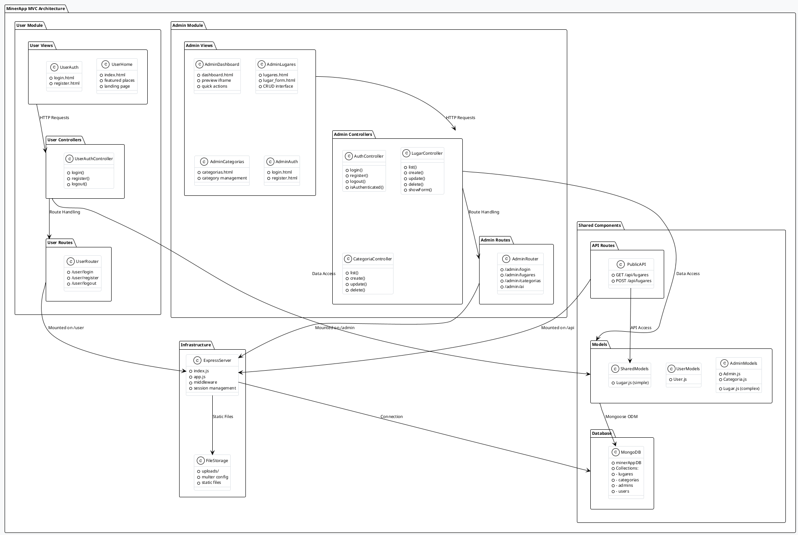
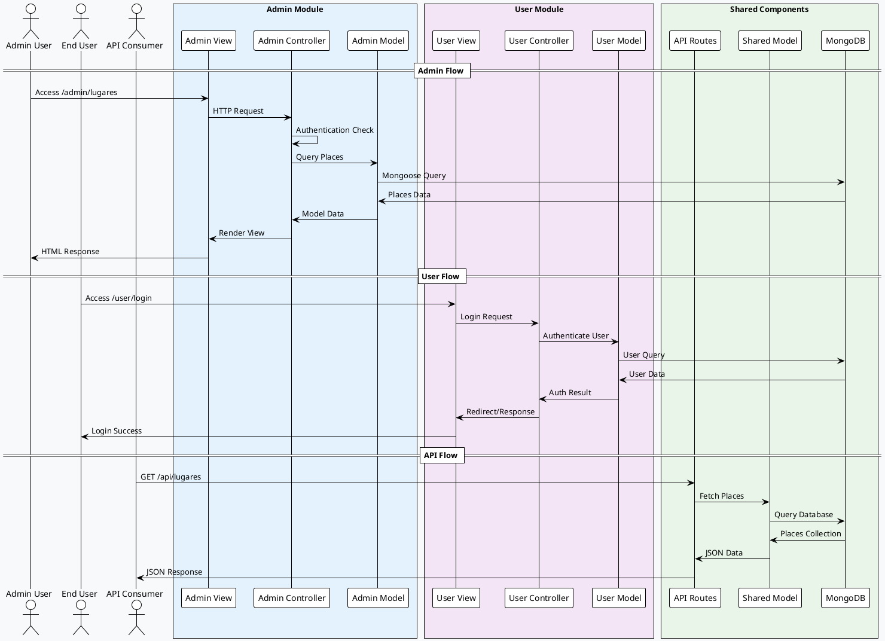
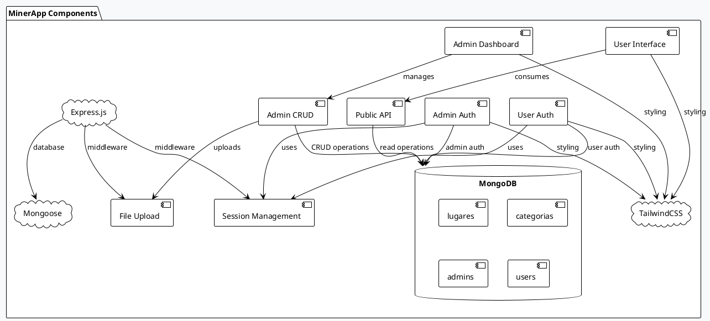
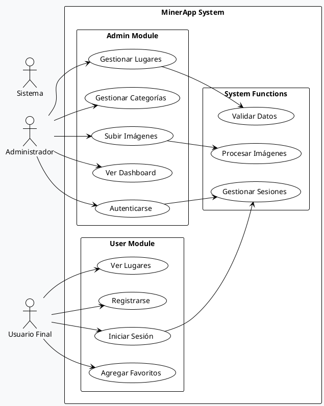

# Diagramas MVC - MinerApp

## Diagrama de Arquitectura MVC

```plantuml
@startuml MVC-Architecture
!theme plain
skinparam backgroundColor #f8f9fa
skinparam defaultFontSize 10
skinparam classBackgroundColor #ffffff
skinparam classBorderColor #dee2e6

package "MinerApp MVC Architecture" {

  package "Admin Module" as AdminModule {
    package "Admin Views" as AdminViews {
      class AdminDashboard {
        + dashboard.html
        + preview iframe
        + quick actions
      }
      class AdminLugares {
        + lugares.html
        + lugar_form.html
        + CRUD interface
      }
      class AdminCategorias {
        + categorias.html
        + category management
      }
      class AdminAuth {
        + login.html
        + register.html
      }
    }

    package "Admin Controllers" as AdminControllers {
      class AuthController {
        + login()
        + register()
        + logout()
        + isAuthenticated()
      }
      class LugarController {
        + list()
        + create()
        + update()
        + delete()
        + showForm()
      }
      class CategoriaController {
        + list()
        + create()
        + update()
        + delete()
      }
    }

    package "Admin Routes" as AdminRoutes {
      class AdminRouter {
        + /admin/login
        + /admin/lugares
        + /admin/categorias
        + /admin/ai
      }
    }
  }

  package "User Module" as UserModule {
    package "User Views" as UserViews {
      class UserHome {
        + index.html
        + featured places
        + landing page
      }
      class UserAuth {
        + login.html
        + register.html
      }
    }

    package "User Controllers" as UserControllers {
      class UserAuthController {
        + login()
        + register()
        + logout()
      }
    }

    package "User Routes" as UserRoutes {
      class UserRouter {
        + /user/login
        + /user/register
        + /user/logout
      }
    }
  }

  package "Shared Components" as SharedComponents {
    package "Models" as Models {
      class AdminModels {
        + Admin.js
        + Lugar.js (complex)
        + Categoria.js
      }
      class UserModels {
        + User.js
      }
      class SharedModels {
        + Lugar.js (simple)
      }
    }

    package "API Routes" as APIRoutes {
      class PublicAPI {
        + GET /api/lugares
        + POST /api/lugares
      }
    }

    package "Database" as Database {
      class MongoDB {
        + minerAppDB
        + Collections:
        + - lugares
        + - categorias
        + - admins
        + - users
      }
    }
  }

  package "Infrastructure" as Infrastructure {
    class ExpressServer {
      + index.js
      + app.js
      + middleware
      + session management
    }
    class FileStorage {
      + uploads/
      + multer config
      + static files
    }
  }
}

' Relationships
AdminViews --> AdminControllers : "HTTP Requests"
AdminControllers --> AdminRoutes : "Route Handling"
AdminControllers --> Models : "Data Access"

UserViews --> UserControllers : "HTTP Requests"
UserControllers --> UserRoutes : "Route Handling"
UserControllers --> Models : "Data Access"

PublicAPI --> SharedModels : "API Access"
Models --> MongoDB : "Mongoose ODM"

AdminRoutes --> ExpressServer : "Mounted on /admin"
UserRoutes --> ExpressServer : "Mounted on /user"
APIRoutes --> ExpressServer : "Mounted on /api"

ExpressServer --> FileStorage : "Static Files"
ExpressServer --> Database : "Connection"

@enduml
```

## Diagrama de Flujo de Datos

```plantuml
@startuml Data-Flow
!theme plain
skinparam backgroundColor #f8f9fa

actor "Admin User" as Admin
actor "End User" as User
actor "API Consumer" as API

box "Admin Module" #e3f2fd
  participant "Admin View" as AV
  participant "Admin Controller" as AC
  participant "Admin Model" as AM
end box

box "User Module" #f3e5f5
  participant "User View" as UV
  participant "User Controller" as UC
  participant "User Model" as UM
end box

box "Shared Components" #e8f5e8
  participant "API Routes" as AR
  participant "Shared Model" as SM
  participant "MongoDB" as DB
end box

== Admin Flow ==
Admin -> AV : Access /admin/lugares
AV -> AC : HTTP Request
AC -> AC : Authentication Check
AC -> AM : Query Places
AM -> DB : Mongoose Query
DB -> AM : Places Data
AM -> AC : Model Data
AC -> AV : Render View
AV -> Admin : HTML Response

== User Flow ==
User -> UV : Access /user/login
UV -> UC : Login Request
UC -> UM : Authenticate User
UM -> DB : User Query
DB -> UM : User Data
UM -> UC : Auth Result
UC -> UV : Redirect/Response
UV -> User : Login Success

== API Flow ==
API -> AR : GET /api/lugares
AR -> SM : Fetch Places
SM -> DB : Query Database
DB -> SM : Places Collection
SM -> AR : JSON Data
AR -> API : JSON Response

@enduml
```

## Diagrama de Componentes

```plantuml
@startuml Components
!theme plain
skinparam backgroundColor #f8f9fa

package "MinerApp Components" {

  [Admin Dashboard] as AD
  [Admin Auth] as AA
  [Admin CRUD] as ACRUD
  
  [User Interface] as UI
  [User Auth] as UA
  
  [Public API] as PAPI
  [File Upload] as FU
  [Session Management] as SM
  
  database "MongoDB" as DB {
    [lugares]
    [categorias] 
    [admins]
    [users]
  }
  
  cloud "TailwindCSS" as TW
  cloud "Express.js" as EX
  cloud "Mongoose" as MG
}

AD --> ACRUD : manages
AA --> SM : uses
ACRUD --> FU : uploads
UI --> PAPI : consumes
UA --> SM : uses

ACRUD --> DB : CRUD operations
PAPI --> DB : read operations
UA --> DB : user auth
AA --> DB : admin auth

AD --> TW : styling
UI --> TW : styling
AA --> TW : styling
UA --> TW : styling

EX --> SM : middleware
EX --> FU : middleware
EX --> MG : database

@enduml
```

## Diagrama de Casos de Uso

```plantuml
@startuml Use-Cases
!theme plain
skinparam backgroundColor #f8f9fa

left to right direction

actor "Administrador" as Admin
actor "Usuario Final" as User
actor "Sistema" as System

rectangle "MinerApp System" {

  rectangle "Admin Module" {
    usecase "Gestionar Lugares" as UC1
    usecase "Gestionar Categorías" as UC2
    usecase "Subir Imágenes" as UC3
    usecase "Ver Dashboard" as UC4
    usecase "Autenticarse" as UC5
  }

  rectangle "User Module" {
    usecase "Ver Lugares" as UC6
    usecase "Registrarse" as UC7
    usecase "Iniciar Sesión" as UC8
    usecase "Agregar Favoritos" as UC9
  }

  rectangle "System Functions" {
    usecase "Validar Datos" as UC10
    usecase "Procesar Imágenes" as UC11
    usecase "Gestionar Sesiones" as UC12
  }
}

Admin --> UC1
Admin --> UC2
Admin --> UC3
Admin --> UC4
Admin --> UC5

User --> UC6
User --> UC7
User --> UC8
User --> UC9

UC1 --> UC10
UC3 --> UC11
UC5 --> UC12
UC8 --> UC12

@enduml
```