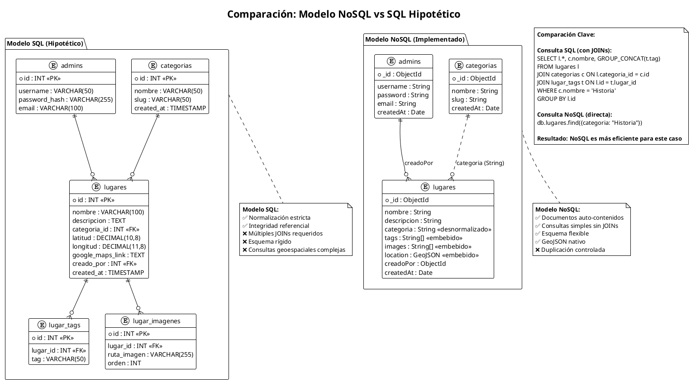
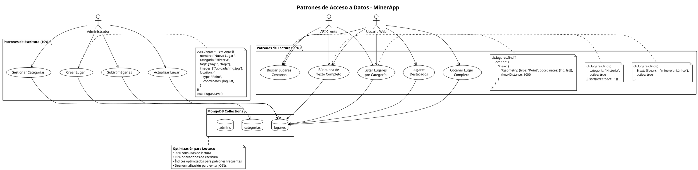

# Diagramas PlantUML - MinerApp

Este archivo contiene todos los diagramas PlantUML para la documentación completa de MinerApp.

## Índice de Diagramas

### 1. Arquitectura MVC
- [Diagrama de Arquitectura MVC](./mvc-diagrams.md#diagrama-de-arquitectura-mvc)
- [Diagrama de Flujo de Datos](./mvc-diagrams.md#diagrama-de-flujo-de-datos)
- [Diagrama de Componentes](./mvc-diagrams.md#diagrama-de-componentes)
- [Diagrama de Casos de Uso](./mvc-diagrams.md#diagrama-de-casos-de-uso)

### 2. Base de Datos NoSQL
- [Diagrama General de Arquitectura NoSQL](#1-diagrama-general-de-arquitectura-nosql)
- [Diagrama Detallado de Colecciones](#2-diagrama-detallado-de-colecciones-y-documentos)
- [Diagrama de Relaciones NoSQL](#3-diagrama-de-relaciones-nosql)
- [Diagrama de Índices y Optimización](#4-diagrama-de-índices-y-optimización)
- [Comparativo NoSQL vs SQL](#5-diagrama-comparativo-nosql-vs-sql)
- [Patrones de Acceso a Datos](#6-diagrama-de-patrones-de-acceso-a-datos)
- [Escalabilidad y Futuro](#7-diagrama-de-escalabilidad-y-futuro)
- [Documento Completo](#8-diagrama-de-documento-completo-ejemplo-real)

---

## Documentación Adicional

- **[Arquitectura MVC Completa](./mvc-architecture.md)** - Descripción detallada del patrón MVC implementado
- **[Diagramas MVC Visuales](./mvc-diagrams.md)** - Diagramas PlantUML de la arquitectura MVC
- **[Diseño de Base de Datos](./database-design.md)** - Especificaciones de la base de datos
- **[Esquemas Mongoose](./mongoose-schemas.md)** - Definiciones de esquemas y modelos

---

## 1. Diagrama General de Arquitectura NoSQL

```plantuml
@startuml MinerApp-Arquitectura-General
!define RECTANGLE class

title MinerApp - Arquitectura Base de Datos NoSQL

package "MongoDB - minerAppDB" {
    
    RECTANGLE "**ADMINS**\nCollection" as admins {
        + _id: ObjectId
        + username: String
        + password: String
        + email: String
        + createdAt: Date
        --
        Índices:
        • username (unique)
        • email (unique)
    }
    
    RECTANGLE "**USERS**\nCollection" as users {
        + _id: ObjectId
        + name: String
        + email: String
        + passwordHash: String
        + createdAt: Date
        --
        Índices:
        • email (unique)
        • createdAt
    }
    
    RECTANGLE "**CATEGORIAS**\nCollection" as categorias {
        + _id: ObjectId
        + nombre: String
        + slug: String
        + descripcion: String
        + icono: String
        + color: String
        + activa: Boolean
        + createdAt: Date
        --
        Índices:
        • nombre (unique)
        • slug (unique)
    }
    
    RECTANGLE "**LUGARES** ⭐\nCollection Principal" as lugares {
        + _id: ObjectId
        + nombre: String
        + descripcion: String
        + categoria: String
        + tags: String[]
        + images: String[]
        + location: GeoJSON
        + googleMapsLink: String
        + horarios: String
        + precio: String
        + creadoPor: ObjectId
        + vistas: Number
        + likes: Number
        + createdAt: Date
        --
        Índices:
        • nombre, categoria, tags
        • location (2dsphere)
        • texto completo
    }
}

' Relaciones
admins ||--o{ lugares : "creadoPor\n(1:N)"
categorias ||--o{ lugares : "categoria\n(String)"

note right of lugares
  **Colección Principal**
  • Datos embebidos: tags[], images[]
  • GeoJSON nativo para ubicación
  • Desnormalización: categoria como String
  • Optimizado para lecturas frecuentes
end note

note top of MongoDB
  **Características NoSQL:**
  • Esquema flexible
  • Consultas geoespaciales
  • Arrays embebidos
  • JSON nativo
  • Escalabilidad horizontal
end note

@enduml
```

---

## 2. Diagrama Detallado de Colecciones y Documentos

```plantuml
@startuml MinerApp-Colecciones-Detalladas
!theme plain

title Diagrama Detallado de Colecciones - MinerApp NoSQL

package "Colección: admins" as AdminsCol {
    object "Documento Admin" as admin1 {
        _id: ObjectId("671c...")
        username: "admin_minerapp"
        password: "$2b$10$..."
        email: "admin@minerapp.com"
        createdAt: ISODate("2025-10-21")
    }
}

package "Colección: categorias" as CategoriasCol {
    object "Historia" as cat1 {
        _id: ObjectId("671c...")
        nombre: "Historia"
        slug: "historia"
        descripcion: "Sitios históricos"
        icono: "fas fa-landmark"
        color: "#8B4513"
        activa: true
        createdAt: ISODate("2025-10-21")
    }
    
    object "Cultura" as cat2 {
        _id: ObjectId("671d...")
        nombre: "Cultura"
        slug: "cultura"
        descripcion: "Tradiciones y eventos"
        icono: "fas fa-theater-masks"
        color: "#9932CC"
        activa: true
        createdAt: ISODate("2025-10-21")
    }
    
    object "Naturaleza" as cat3 {
        _id: ObjectId("671e...")
        nombre: "Naturaleza"
        slug: "naturaleza"
        descripcion: "Parques y senderos"
        icono: "fas fa-tree"
        color: "#228B22"
        activa: true
        createdAt: ISODate("2025-10-21")
    }
}

package "Colección: lugares ⭐" as LugaresCol {
    object "Panteón Inglés" as lugar1 {
        _id: ObjectId("671f...")
        nombre: "Panteón Inglés"
        descripcion: "Cementerio histórico..."
        categoria: "Historia"
        tags: ["cementerio", "británico", "mineros"]
        images: ["/uploads/panteon1.jpg", "/uploads/panteon2.jpg"]
        location: {
            type: "Point",
            coordinates: [-98.567890, 20.123456]
        }
        googleMapsLink: "https://goo.gl/maps/9Y3z..."
        horarios: "9:00 AM - 5:00 PM"
        precio: "Entrada libre"
        creadoPor: ObjectId("671c...")
        vistas: 156
        likes: 23
        createdAt: ISODate("2025-10-15")
    }
    
    object "Museo de Minería" as lugar2 {
        _id: ObjectId("6720...")
        nombre: "Museo de Minería"
        descripcion: "Historia minera de la región..."
        categoria: "Historia"
        tags: ["museo", "minería", "plata", "educativo"]
        images: ["/uploads/museo1.jpg", "/uploads/museo2.jpg"]
        location: {
            type: "Point",
            coordinates: [-98.567123, 20.125789]
        }
        googleMapsLink: "https://goo.gl/maps/7Y3z..."
        horarios: "10:00 AM - 6:00 PM"
        precio: "$30 adultos"
        creadoPor: ObjectId("671c...")
        vistas: 89
        likes: 15
        createdAt: ISODate("2025-10-16")
    }
    
    object "Parque El Chico" as lugar3 {
        _id: ObjectId("6721...")
        nombre: "Parque Nacional El Chico"
        descripcion: "Área natural protegida..."
        categoria: "Naturaleza"
        tags: ["parque", "senderismo", "naturaleza", "camping"]
        images: ["/uploads/parque1.jpg", "/uploads/parque2.jpg"]
        location: {
            type: "Point",
            coordinates: [-98.567000, 20.124000]
        }
        googleMapsLink: "https://goo.gl/maps/6Y3z..."
        horarios: "6:00 AM - 6:00 PM"
        precio: "Entrada libre"
        creadoPor: ObjectId("671c...")
        vistas: 234
        likes: 45
        createdAt: ISODate("2025-10-17")
    }
}

package "Colección: users" as UsersCol {
    object "Usuario 1" as user1 {
        _id: ObjectId("6722...")
        name: "María González"
        email: "maria@email.com"
        passwordHash: "$2b$10$aBc..."
        createdAt: ISODate("2025-10-20")
    }
    
    object "Usuario 2" as user2 {
        _id: ObjectId("6723...")
        name: "Juan Pérez"
        email: "juan@email.com"
        passwordHash: "$2b$10$dEf..."
        createdAt: ISODate("2025-10-21")
    }
}

' Relaciones
admin1 --> lugar1 : creadoPor
admin1 --> lugar2 : creadoPor
admin1 --> lugar3 : creadoPor

lugar1 ..> cat1 : categoria="Historia"
lugar2 ..> cat1 : categoria="Historia"
lugar3 ..> cat3 : categoria="Naturaleza"

note bottom of LugaresCol
**Características de Documentos:**
• Arrays embebidos: tags[], images[]
• GeoJSON para ubicación
• Referencias: creadoPor (ObjectId)
• Desnormalización: categoria (String)
• Campos flexibles: horarios, precio
end note

@enduml
```

---

## 3. Diagrama de Relaciones NoSQL

```plantuml
@startuml MinerApp-Relaciones-NoSQL
!theme plain

title Relaciones en Modelo NoSQL - MinerApp

entity "ADMINS" as admins {
    * _id : ObjectId <<PK>>
    --
    username : String <<unique>>
    password : String
    email : String <<unique>>
    createdAt : Date
}

entity "CATEGORIAS" as categorias {
    * _id : ObjectId <<PK>>
    --
    nombre : String <<unique>>
    slug : String <<unique>>
    descripcion : String
    icono : String
    color : String
    activa : Boolean
    createdAt : Date
}

entity "LUGARES ⭐" as lugares {
    * _id : ObjectId <<PK>>
    --
    nombre : String
    descripcion : String
    categoria : String <<desnormalizado>>
    tags : String[] <<embebido>>
    images : String[] <<embebido>>
    location : GeoJSON <<embebido>>
    googleMapsLink : String
    horarios : String
    precio : String
    telefono : String
    sitioWeb : String
    activo : Boolean
    destacado : Boolean
    creadoPor : ObjectId <<FK>>
    vistas : Number
    likes : Number
    createdAt : Date
    updatedAt : Date
}

entity "USERS" as users {
    * _id : ObjectId <<PK>>
    --
    name : String
    email : String <<unique>>
    passwordHash : String
    createdAt : Date
}

' Relaciones
admins ||--o{ lugares : "1:N\ncreadoPor"
categorias ||..o{ lugares : "1:N\ncategoria (String)"

note right of lugares::categoria
**Desnormalización:**
Campo categoria almacena el nombre
directamente en lugar de ObjectId
para optimizar consultas
end note

note left of lugares::tags
**Arrays Embebidos:**
• tags: ["minero", "británico"]
• images: ["/uploads/img1.jpg"]
Evita tablas separadas
end note

note bottom of lugares::location
**GeoJSON Nativo:**
{
  type: "Point",
  coordinates: [lng, lat]
}
Soporte geoespacial optimizado
end note

' Futuras relaciones (en desarrollo)
entity "FAVORITOS\n(Futuro)" as favoritos #lightgray {
    * _id : ObjectId
    --
    userId : ObjectId
    lugarId : ObjectId
    createdAt : Date
}

entity "COMENTARIOS\n(Futuro)" as comentarios #lightgray {
    * _id : ObjectId
    --
    lugarId : ObjectId
    userId : ObjectId
    comentario : String
    rating : Number
    createdAt : Date
}

users ||--o{ favoritos : "1:N (futuro)"
lugares ||--o{ favoritos : "1:N (futuro)"
users ||--o{ comentarios : "1:N (futuro)"
lugares ||--o{ comentarios : "1:N (futuro)"

@enduml
```

---

## 4. Diagrama de Índices y Optimización

```plantuml
@startuml MinerApp-Indices-Optimizacion
!theme plain

title Estrategia de Índices - MinerApp NoSQL

package "Colección: lugares" as LugaresIdx {
    
    class "Índices Simples" as simple {
        + nombre: 1
        + categoria: 1
        + activo: 1
        + destacado: 1
        + createdAt: -1
        + creadoPor: 1
    }
    
    class "Índices Compuestos" as compuestos {
        + {categoria: 1, activo: 1, createdAt: -1}
        + {categoria: 1, tags: 1}
        + {activo: 1, destacado: 1}
    }
    
    class "Índice Geoespacial" as geo {
        + location: "2dsphere"
        --
        Permite:
        • $near queries
        • $geoWithin
        • $geoIntersects
    }
    
    class "Índice de Texto" as texto {
        + {nombre: "text", descripcion: "text", tags: "text"}
        --
        Pesos:
        • nombre: 10
        • descripcion: 5
        • tags: 1
    }
}

package "Consultas Optimizadas" as queries {
    
    class "Por Categoría" as q1 {
        db.lugares.find({
            categoria: "Historia",
            activo: true
        })
        --
        Usa: categoria + activo
    }
    
    class "Geoespacial" as q2 {
        db.lugares.find({
            location: {
                $near: {
                    $geometry: {
                        type: "Point",
                        coordinates: [-98.567, 20.123]
                    },
                    $maxDistance: 1000
                }
            }
        })
        --
        Usa: location (2dsphere)
    }
    
    class "Búsqueda de Texto" as q3 {
        db.lugares.find({
            $text: {
                $search: "minero británico"
            }
        })
        --
        Usa: text index
    }
    
    class "Filtros Combinados" as q4 {
        db.lugares.find({
            categoria: "Historia",
            tags: {$in: ["británico"]},
            activo: true
        }).sort({createdAt: -1})
        --
        Usa: categoria + tags + activo
    }
}

simple --> q1
compuestos --> q1
compuestos --> q4
geo --> q2
texto --> q3

note top of LugaresIdx
**Estrategia de Indexación:**
• Índices simples para consultas básicas
• Compuestos para filtros múltiples  
• Geoespacial para ubicaciones
• Texto completo para búsquedas
end note

@enduml
```

---

## 5. Diagrama Comparativo NoSQL vs SQL



---

## 6. Diagrama de Patrones de Acceso a Datos



---

## 7. Diagrama de Escalabilidad y Futuro

```plantuml
@startuml MinerApp-Escalabilidad
!theme plain

title Estrategia de Escalabilidad - MinerApp NoSQL

package "Arquitectura Actual" as actual {
    node "MongoDB\nSingle Instance" as mongo_single {
        database "minerAppDB" as db_current
    }
    
    node "Node.js\nExpress Server" as node_current
    
    node_current --> mongo_single : Mongoose ODM
}

package "Escalabilidad Horizontal (Futuro)" as futuro {
    
    node "MongoDB\nReplica Set" as mongo_replica {
        database "Primary" as primary
        database "Secondary 1" as secondary1  
        database "Secondary 2" as secondary2
    }
    
    node "MongoDB\nSharded Cluster" as mongo_sharded {
        database "Shard 1\n(Hidalgo)" as shard1
        database "Shard 2\n(CDMX)" as shard2
        database "Shard N\n(Otras regiones)" as shardN
        database "Config Servers" as config
    }
    
    node "Load Balancer" as lb
    node "Node.js\nInstance 1" as node1
    node "Node.js\nInstance 2" as node2
    node "Node.js\nInstance N" as nodeN
    
    cloud "Redis Cache" as redis
    
    lb --> node1
    lb --> node2 
    lb --> nodeN
    
    node1 --> mongo_replica
    node2 --> mongo_replica
    nodeN --> mongo_replica
    
    node1 --> redis
    node2 --> redis
    nodeN --> redis
    
    primary --> secondary1 : Replication
    primary --> secondary2 : Replication
}

package "Extensiones de Datos" as extensiones {
    
    entity "favoritos" as fav {
        * _id : ObjectId
        --
        userId : ObjectId
        lugarId : ObjectId
        createdAt : Date
    }
    
    entity "comentarios" as com {
        * _id : ObjectId
        --
        lugarId : ObjectId
        userId : ObjectId
        comentario : String
        rating : Number
        createdAt : Date
    }
    
    entity "rutas" as rutas {
        * _id : ObjectId
        --
        nombre : String
        descripcion : String
        lugares : ObjectId[]
        duracion : String
        dificultad : String
        createdAt : Date
    }
    
    entity "analytics" as analytics {
        * _id : ObjectId
        --
        lugarId : ObjectId
        fecha : Date
        vistas : Number
        busquedas : Number
        origen : String
    }
}

note top of futuro
**Estrategias de Escalabilidad:**
• Replica Set para alta disponibilidad
• Sharding por región geográfica
• Cache Redis para consultas frecuentes
• Load balancing para distribución
end note

note right of extensiones
**Nuevas Colecciones:**
• favoritos: Lugares favoritos de usuarios
• comentarios: Reviews y calificaciones
• rutas: Rutas turísticas predefinidas
• analytics: Métricas y estadísticas
end note

note bottom of mongo_sharded
**Sharding Strategy:**
• Shard key: location.coordinates
• Por región geográfica
• Consultas locales más rápidas
• Expansión a nuevas regiones
end note

@enduml
```

---

## 8. Diagrama de Documento Completo (Ejemplo Real)

```plantuml
@startuml MinerApp-Documento-Completo
!theme plain

title Estructura Completa de Documento - Colección 'lugares'

object "Panteón Inglés" as lugar {
    **Identificación**
    _id: ObjectId("671c1a2b3d4e5f6789abcd22")
    
    **Información Basic**
    nombre: "Panteón Inglés"
    descripcion: "Cementerio histórico que alberga las tumbas de mineros británicos que llegaron a Real del Monte en el siglo XIX. Rodeado de un paisaje único con árboles centenarios y arquitectura funeraria distintiva."
    
    **Clasificación**
    categoria: "Historia"
    tags: ["cementerio", "británico", "mineros", "histórico", "siglo XIX", "arquitectura funeraria"]
    
    **Multimedia (Arrays Embebidos)**
    images: [
        "/uploads/panteon_entrada_principal.jpg",
        "/uploads/panteon_tumbas_britanicas.jpg", 
        "/uploads/panteon_paisaje_general.jpg",
        "/uploads/panteon_arquitectura_detalle.jpg"
    ]
    
    **Ubicación (GeoJSON)**
    location: {
        type: "Point",
        coordinates: [-98.567890, 20.123456]
    }
    googleMapsLink: "https://goo.gl/maps/9Y3z5Z9h9z72"
    
    **Información Práctica**
    horarios: "Lunes a Domingo: 9:00 AM - 5:00 PM"
    precio: "Entrada libre"
    telefono: "+52 771 797 1234"
    sitioWeb: "https://realdelmonte.gob.mx/panteon-ingles"
    
    **Estado y Metadata**
    activo: true
    destacado: true
    creadoPor: ObjectId("671c1a2b3d4e5f6789abcdef")
    
    **Estadísticas**
    vistas: 1247
    likes: 89
    
    **Timestamps**
    createdAt: ISODate("2025-10-15T09:30:00Z")
    updatedAt: ISODate("2025-10-20T14:45:00Z")
}

note right of lugar::tags
**Arrays Embebidos - Tags:**
• Búsquedas rápidas con $in
• No requiere tabla separada
• Flexibilidad para agregar tags
• Indexado para texto completo
end note

note left of lugar::location
**GeoJSON Nativo:**
• Tipo "Point" estándar
• Coordenadas [longitud, latitud]
• Soporte nativo para queries geoespaciales
• Índice 2dsphere automático
end note

note bottom of lugar::images
**Gestión de Imágenes:**
• Array de rutas relativas
• Máximo 10 imágenes por lugar
• Validación de formatos
• Orden implícito por posición
end note

object "Ejemplo Consulta" as consulta {
    **Buscar lugares cercanos:**
    db.lugares.find({
        location: {
            $near: {
                $geometry: {
                    type: "Point", 
                    coordinates: [-98.567890, 20.123456]
                },
                $maxDistance: 500
            }
        },
        activo: true
    })
    
    **Buscar por tags:**
    db.lugares.find({
        tags: {$in: ["británico", "histórico"]},
        categoria: "Historia"
    })
    
    **Búsqueda de texto:**
    db.lugares.find({
        $text: {$search: "mineros británicos cementerio"}
    }).sort({score: {$meta: "textScore"}})
}

lugar --> consulta : "Ejemplos de uso"

@enduml
```

---

## Instrucciones de Uso

### Cómo usar estos diagramas PlantUML:

1. **Herramientas Online:**
   - [PlantUML Online Server](http://www.plantuml.com/plantuml/uml/)
   - [PlantText](https://www.planttext.com/)

2. **Extensiones VS Code:**
   - PlantUML Extension
   - Preview automático

3. **Herramientas Desktop:**
   - PlantUML JAR file
   - IntelliJ IDEA con plugin

### Exportar diagramas:
```bash
# Generar PNG
java -jar plantuml.jar -tpng diagrama.puml

# Generar SVG
java -jar plantuml.jar -tsvg diagrama.puml

# Generar PDF
java -jar plantuml.jar -tpdf diagrama.puml
```

---

*Diagramas PlantUML - MinerApp Base de Datos NoSQL*  
*Documentación visual completa del modelo no relacional*  
*Octubre 2025*